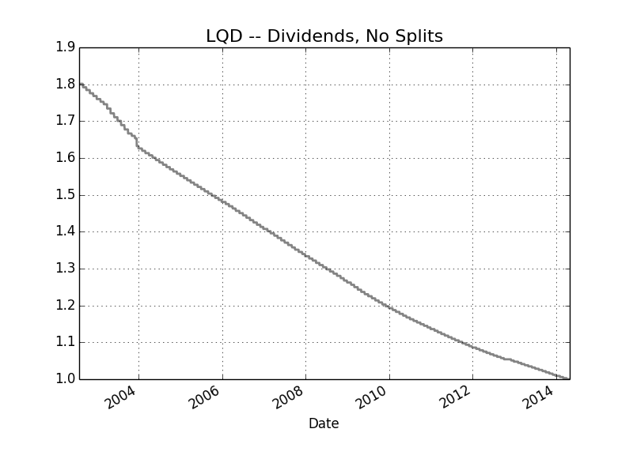
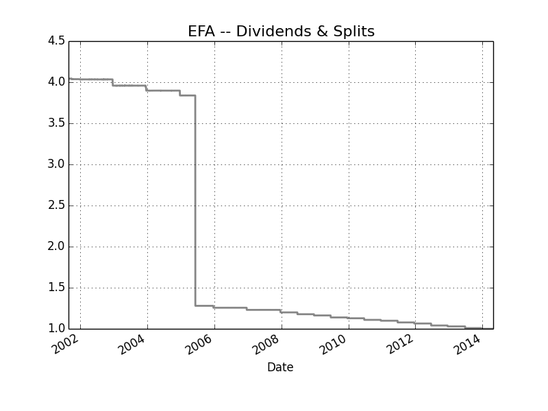
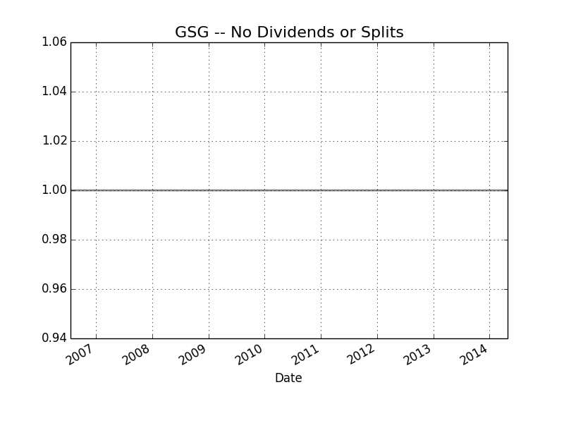
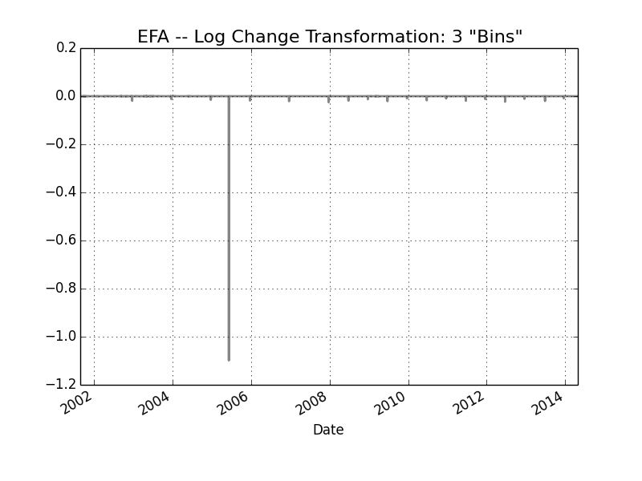

#clean-fin-data

A module to help you store, append, and scrub financial data using `HDF5` data structures to ensure speed and efficiency

##Installation

###Clone the Repository

	$ git clone https://github.com/benjaminmgross/clean-fin-data
	$ cd clean-fin-data
	$ python setup.py install

###Test the install

	$ ipython
	Python 2.7.6 (default, Nov 12 2013, 10:54:02) 
	Type "copyright", "credits" or "license" for more information.

	IPython 2.0.0 -- An enhanced Interactive Python.
	?         -> Introduction and overview of IPython's features.
	%quickref -> Quick reference.
	help      -> Python's own help system.
	object?   -> Details about 'object', use 'object??' for extra details.

	In [1]: import clean_fin_data
	

##Dependencies

- `pandas` (obviously)
- `tables` (as in `PyTables`)

To install `tables` on Mac OS X Mavericks, you need [`HDF5`](http://www.hdfgroup.org/). I did the following to get `HDF5` functionality up and running (if you have Windows, it `PyTables` comes pre-installed with [`Anaconda`](https://store.continuum.io/cshop/anaconda/) and [`Enthought`](https://www.enthought.com/products/epd/), so you can skip this step):

1. You can't just `$ brew install hdf5` using [`homebrew`](http://brew.sh/), you actually need to go to [`Homebrew Science`](https://github.com/Homebrew/homebrew-science/) to get it.  So execute the following commands:

		$ brew tap homebrew/science
		
		#Then you can brew install it
		
		$ brew install hdf5
		
2. Now you've got the necessary components to install `PyTables` with `pip`:

		$ pip install tables
		
**NOTE:** Just because you have `pandas` installed doesn't mean you have `tables`, so if you try to execute any of this code and get:

	.. ERROR:: Could not find a local HDF5 installation.

You probably need to execute the steps just covered.

##Filling the Gaps

###The Motivation

[Yahoo! Finance Data](finance.yahoo.com) has historically been quite good, but of recent you may (as I did) find rather large gaps in historical price information.  When it comes to portfolio price calculation or metric estimation, those holes (which I've found [for some](http://finance.yahoo.com/q?s=eem) to be 19 trading days) can wreak havoc.  The upside is that [Google Finance](https://www.google.com/finance) often has those prices... the downside is that Google Finance doesn't have Adjusted Close, and therefore the Adjusted Close needs to be estimated.

###Classifying Transform of Adjusted Close & Close

Standard methodology to calculate Close and Adjusted Close, based on some sort of stock split or dividend is well explained [here, at this Yahoo! Tutorial](https://help.yahoo.com/kb/finance/historical-prices-sln2311.html?impressions=true).  One method to determine whether a stock split or dividend payment has occurred is by using the ratio of the Close to Adjusted Close for each price date.

It should intuitively make sense that the ratio of price Close to Adjusted Close will take on one of the following four situations, and be graphically represented in some sort of similar looking graph:

####1. Dividends and no splits occurred:

####2. Dividends and splits occurred:

####3. Neither Dividends Nor Splits

####4. Splits only
(no image found)

The next step is to perform a log transformation can be performed and then a classification algorithm run, to determine whether a log change is:

1. White Noise
2. A Dividend
3. A Split (or Reverse Split)

With that information, and with a known Close Date, we can get really close to the actual Adjusted Close, and, if dividends or splits have occurred, make the necessary adjustments to the... well, Adjusted Close.

##Tickers to train Logistic Algorithm

| Ticker | Did Either Algo Work? |Were Any Non-WN Points Captured? |
|:-------|:----------------------|:--------------------------------|
| EWD    | No | No |
| EWN    | No | Yes|
| EWI    | Yes| Yes|
| XLB    | Yes | Missed 1 |
| QQQ    | No | Missed All |
| IJR    | No | Yes, Missed Most |
| IWM    | No | Yes, Missed Most |
| IYZ   | Yes| Missed 1 |
| IYE | No | Missed Several |
| IYR | No | Missed Most |
| IWN | No | Missed Most |
| IJS | Yes| Missed a Couple |
| IJT | No | Missed Most |
| IJJ | No | Missed Most |
| IJK | No | Missed Most |
| EZU | No | Missed Most |
| ICF | Yes| Missed 1 |
| RWR | No | Missed Several |
| VTI | No | Missed Several |
| IWS | No | Missed All |
| IWP | No | Missed Most |
| IGE | No | Missed Most |
| EPP | No | Missed All |

EWI, EWG, EWC: Blue algo was positive

	

##To Do
- ~~Create the ability to check if a ticker is already a member of a store~~
- Write the scrub functionality
- ~~Write the append functionality~~
- Consider writing to a log file that specifies all of the additions / changes / etc. that were accomplished in each function
- Create some sort of testing mechanism to compare performance of read / write capacity of `cPickle` and `HDF5`.
- The dates for Google, Yahoo!, and those generated by `pandas.bdate_range` are all different, and the current "store" has all `nan`'s removed.  So,
  1. ~~Some kind of "master index" needs to be created~~
  2. ~~That master index then needs to be used to determine the gaps in the data~~
  3. ~~Then the gaps themselves need to be filled in some way~~
